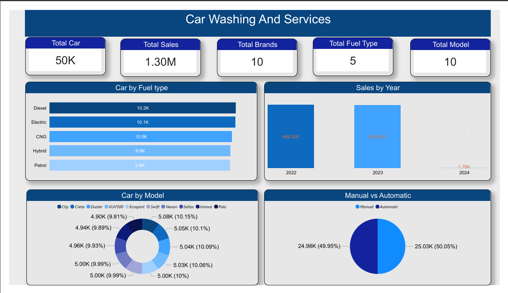

# Car Washing and Services Power BI Dashboard

## Project Overview

This project is a complete **ETL and Business Intelligence Dashboard** project based on car washing and service-related data.

The main goal of this project is to collect multiple data files, clean and transform them through an ETL process, store them in SQL Server, create a master table, and finally build an interactive dashboard in Power BI.

The dashboard provides a clear overview of total cars, sales, brands, fuel types, models, fuel-wise car distribution, yearly sales performance, model-wise car count, and transmission type analysis.

---

## Tools and Technologies Used

* Microsoft Excel
* SQL Server Management Studio
* SQL Server Database
* ETL Process
* Power BI
* Data Modeling
* Data Visualization
* GitHub

---

## Dataset Information

This project uses five different data files:

1. `Car_Data.csv`
2. `Insurance_data.csv`
3. `Owners_data.csv`
4. `Sales_data.csv`
5. `Service_History.csv`

Each file contains different information related to cars, owners, sales, insurance, and service history.

---

## ETL Process

The ETL process was completed in the following steps:

### 1. Extract

Data was collected from five different files:

* Car details
* Insurance details
* Owner details
* Sales details
* Service history details

### 2. Transform

The data was cleaned and prepared before analysis.

The transformation process included:

* Checking column names
* Removing unnecessary spaces
* Matching data using `Car_ID`
* Combining related tables
* Preparing a clean master table
* Ensuring correct data types for date, number, and text fields

### 3. Load

After transformation, all files were imported into **SQL Server Management Studio**.

Then a single master table was created by joining the five tables using `Car_ID`.

The master table was then connected to Power BI for dashboard creation.

---

## Database Design

The main common column used for table relationship was:

```sql
Car_ID
```

The five source tables were combined into one master table using SQL Server.

Example workflow:

```text
Excel / CSV Files
        ↓
ETL Process
        ↓
SQL Server Management Studio
        ↓
Master Table
        ↓
Power BI Dashboard
```

---

## SQL Server Process

The five source tables were imported into SQL Server:

* `Car_Data`
* `Insurance_data`
* `Owners_data`
* `Sales_data`
* `Service_History`

After importing the datasets, a master table was created by joining all tables using the common column `Car_ID`.

The SQL query file is included in this repository:

```text
sql/master_table_query.sql
```

---

## Power BI Dashboard Features

The dashboard includes several KPI cards and charts to present the overall car washing and services business performance.

### KPI Cards

* Total Car
* Total Sales
* Total Brands
* Total Fuel Type
* Total Model

### Charts and Visuals

* Car by Fuel Type
* Sales by Year
* Car by Model
* Manual vs Automatic Transmission

---

## Dashboard Preview



---

## Key Insights

* Total number of cars analyzed: **50K**
* Total sales amount: **1.30M**
* Total brands: **10**
* Total fuel types: **5**
* Total car models: **10**
* Diesel and Electric cars have the highest count among all fuel types.
* Sales performance was highest in **2022** and **2023**.
* Manual and Automatic transmission cars are almost equally distributed.


## Conclusion

This project presents a complete ETL and dashboard development process using SQL Server and Power BI.

It shows how multiple raw data files can be imported, transformed, combined into a master table, and visualized through an interactive dashboard.

The dashboard provides useful insights about cars, sales, fuel types, models, brands, and transmission categories.
::: 
